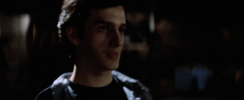

<div align="center">

# Proofcast

_A bodycam for AI_



</div>

Proofcast is an AI bodycam that lets you record the terminal output that _it_
sees, uncovering all the gruesome details...

> ___what do you mean it was only staging!?___

---

## Install

```bash
npx skills@latest add killallgit/killall-proof \
  --skill proofcast \
  --agent claude-code \
  --global \
  --yes
```

**Pre-reqs**

| | |
|---|---|
| `asciinema` 3.0+ | required |
| `agg` | optional — adds a gif alongside each recording |

## How to use

Ask Claude Code to record something. Recordings land in `.proofcast` next to
wherever it ran:

```
.proofcast/index.html
.proofcast/<slug>/<timestamp>.cast
.proofcast/<slug>/<timestamp>.stdout.log
.proofcast/<slug>/<timestamp>.gif
```

Open `index.html` from disk. It lists every recording and replays them as real
text you can pause, scrub, and copy from.

## Accountability, as ever, has limits

Output that scrolls faster than the terminal can draw collapses into a single
frame, so the footage shows the aftermath rather than the incident. The full
text survives in the log, which nobody watches.

Everything the agent printed is captured verbatim, **including your secrets**.
Proofcast does not redact them. Add `.proofcast/` to `.gitignore`.

Recordings are kept until someone deletes them, and someone always does.
